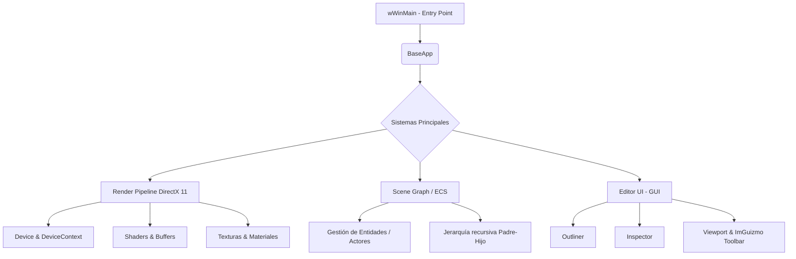

# 🌿 Wildvine Engine

**WildvineEngine** es un motor gráfico 3D de alto rendimiento desarrollado en **C++** y **DirectX 11**. Este proyecto sirve como compendio práctico y arquitectónico para la materia de **Gráficas Computacionales 3D (Generación 2026-01)**.

El motor implementa una arquitectura moderna basada en un **Grafo de Escena (Scene Graph)**, un sistema base de **Entidades y Componentes (ECS)**, y un **Editor Visual** completo utilizando *Dear ImGui* e *ImGuizmo*.

---

## 📊 Arquitectura del Motor (Diagrama de Flujo)

A continuación, se presenta la arquitectura de alto nivel de WildvineEngine y cómo interactúan sus sistemas principales durante el ciclo de vida de la aplicación:



---

## ⚙️ Sistemas y Características Principales

El motor está modularizado en varias utilidades y subsistemas fundamentales.

### 1. Sistema de Componentes (ECS Base)
El motor utiliza un enfoque orientado a datos para definir los objetos en pantalla. Los tipos de componentes disponibles son:

| Tipo de Componente | Descripción de su función en el motor |
| :--- | :--- |
| **NONE** | Tipo base o componente no inicializado. |
| **TRANSFORM** | Almacena y calcula la matriz de mundo (Posición, Rotación, Escala). |
| **MESH** | Contiene los datos de vértices e índices para el renderizado 3D. |
| **MATERIAL** | Define cómo la luz interactúa con la superficie (Shaders, Texturas). |
| **HIERARCHY** | Gestiona las relaciones de nodos dentro del Grafo de Escena. |

### 2. Scene Graph (Grafo de Escena)
Implementa un árbol jerárquico dinámico para gestionar las entidades en el mundo 3D.
* **Relaciones Padre-Hijo:** Permite adjuntar (`attach`) o separar (`detach`) entidades fácilmente.
* **Transformaciones Locales y Globales:** Usa la función `updateWorldRecursive` para calcular la posición final de un objeto basándose en sus ancestros (`parentWorld`).

### 3. Editor Visual Integrado (GUI)
Construido con la robusta librería **ImGui**, el editor proporciona herramientas de desarrollo en tiempo real:

| Panel / Herramienta | Funcionalidad |
| :--- | :--- |
| **Dockspace** | Permite acoplar y organizar ventanas del editor dinámicamente. |
| **Outliner** | Muestra la lista jerárquica de todos los `Actors` presentes en la escena. |
| **Inspector** | Panel para editar las propiedades (Transform, variables, etc.) del actor seleccionado. |
| **Viewport** | Renderiza la escena 3D dentro de una ventana de ImGui usando un `ShaderResourceView`. |
| **ImGuizmo** | Proporciona manipuladores visuales (Gizmos) en pantalla para Traslación, Rotación y Escala. |

---

## 🛠️ Tecnologías y Dependencias

WildvineEngine se apoya en librerías estándar de la industria para garantizar estabilidad y rendimiento.

| Tecnología / Librería | Uso dentro de WildvineEngine |
| :--- | :--- |
| **C++ 11+** | Lenguaje principal. Implementación de punteros inteligentes propios (`TSharedPointer`, `TUniquePtr`). |
| **DirectX 11** | API Gráfica (Device, DeviceContext, SwapChain, Buffers, DepthStencil). |
| **XNAMath** | Librería matemática para el manejo eficiente de Matrices (`XMMATRIX`) y Vectores (`XMFLOAT4X4`). |
| **FBX SDK** | Importación y procesamiento de modelos 3D y geometría compleja. |
| **Dear ImGui** | Creación de interfaces gráficas de usuario inmediatas y paneles del editor. |
| **ImGuizmo** | Extensión de ImGui para la manipulación espacial 3D. |
| **stb_image** | Carga de texturas e imágenes (PNG, JPG, etc.). |

---

## 📂 Estructura de Directorios

Una vista general de cómo está organizado el repositorio:

* `WildvineEngine/include/`: Archivos de cabecera (`.h`). Contiene las definiciones de sistemas (`SceneGraph`, `ECS`, `GUI`), utilidades del motor y envolturas de DirectX.
* `WildvineEngine/source/`: Código fuente (`.cpp`). Implementaciones lógicas como `Window`, `Texture`, `BaseApp` y el pipeline gráfico.
* `WildvineEngine/lib/`: Librerías estáticas precompiladas (Ej. `fbxlibs`, `zlib.lib`, `libxml2.lib`).
* `WildvineEngine/Imgui/`: Código fuente y backends de ImGui/ImGuizmo preparados para DirectX 11 y Win32.

---

## 🚀 Requisitos de Compilación e Instalación

1. **IDE:** Microsoft Visual Studio (Se recomienda la versión 2019 o 2022).
2. **SDKs Requeridos:**
   * Windows SDK (para incluir las dependencias nativas de `windows.h` y DirectX11).
   * Autodesk FBX SDK.
3. **Instrucciones:**
   * Abre la solución `WildvineEngine_2010.sln` o la correspondiente a tu versión en Visual Studio.
   * Selecciona la configuración de compilación adecuada (Debug/Release y x64).
   * Compila (`Ctrl + Shift + B`) y ejecuta el proyecto.

---
*Desarrollado con fines educativos y de investigación en arquitectura de motores de videojuegos.*
```
